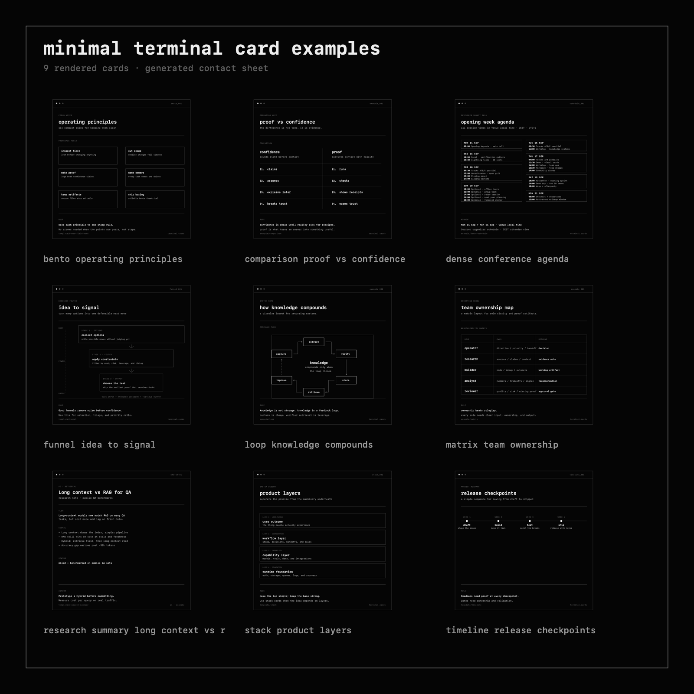
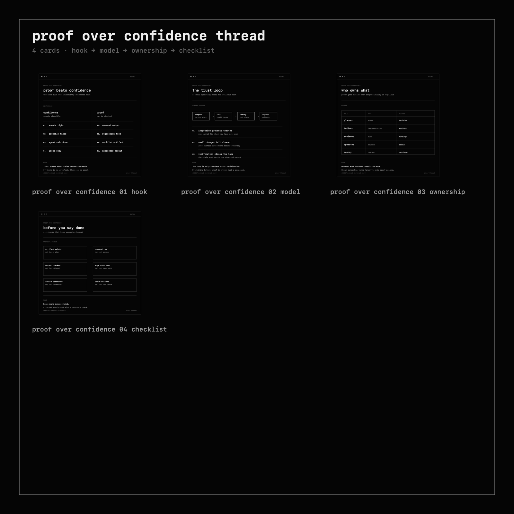

# Minimal Terminal Card

Minimal Terminal Card is a black-and-white terminal-style visual system for turning ideas, notes, conversations, and workflows into crisp SVG/PNG cards.

It is designed for text-heavy images where normal image generation usually fails: diagrams, labels, tables, process cards, schedules, and compact visual summaries.

The default output is one square PNG. Multi-card thread mode exists only for ideas that would become cramped or unreadable as a single card.

## Preview



Thread mode example:



## Use Cases

Use Minimal Terminal Card for:

- X/Twitter-ready visual notes
- compact diagrams from ideas or conversations
- workflow/process cards
- comparison cards
- operating principles and checklists
- dense schedule/agenda cards
- multi-card threads or carousels when one card would become unreadable

Do **not** use it for photorealistic images, colorful posters, data visualizations with unverified numbers, or long-form documents.

## Installation

Clone the repo:

```bash
git clone git@github.com:banozz0/minimal-terminal-card.git
cd minimal-terminal-card
```

Or with HTTPS:

```bash
git clone https://github.com/banozz0/minimal-terminal-card.git
cd minimal-terminal-card
```

Requirements:

- Python 3
- one SVG-to-PNG renderer:
  - macOS: `qlmanage` usually works out of the box
  - Linux/macOS: `rsvg-convert` or `inkscape`

No Python package install is required for the bundled helper script.

## What It Includes

```text
SKILL.md                         main workflow and usage rules
templates/                       editable SVG layout templates
examples/                        rendered single-card examples
threads/proof-over-confidence/   V1.3 reference thread
references/                      detailed layout and thread guidance
scripts/minimal_card.py          render, validate, and contact-sheet helper
```

## Layouts

Current templates:

- `comparison` — A/B contrasts
- `loop` — recurring systems and feedback loops
- `matrix` — ownership/capability maps
- `hub-spoke` — central concept with surrounding modules
- `agency-map` — operating model / delegation maps
- `linear-process` — step-by-step flows
- `dense-field-note` — compact notes or schedule-like cards
- `timeline` — roadmap/checkpoint sequences
- `stack` — layered systems
- `funnel` — narrowing/filtering decisions
- `bento-field-note` — peer principles/rules

## Quick Start

Render an existing example:

```bash
python3 scripts/minimal_card.py render examples/comparison-proof-vs-confidence.svg
```

Validate examples and templates:

```bash
python3 scripts/minimal_card.py validate examples/*.svg examples/*.png templates/*.svg
```

Regenerate the example contact sheet:

```bash
python3 scripts/minimal_card.py contact-sheet --dir examples --out examples/example-contact-sheet.svg
python3 scripts/minimal_card.py render examples/example-contact-sheet.svg
```

## Creating a New Card

1. Pick the template that matches the information shape.
2. Copy it to a working file.
3. Replace placeholders such as `{{TITLE}}`, `{{SUBTITLE}}`, and layout-specific fields.
4. Render the SVG to PNG.
5. Validate and visually QA the PNG before sharing.

Example:

```bash
cp templates/comparison.svg my-card.svg
# edit my-card.svg
python3 scripts/minimal_card.py render my-card.svg
python3 scripts/minimal_card.py validate my-card.svg my-card.png
```

## Multi-card Thread Mode

Use thread mode only when one card would be overloaded.

Good reasons to split:

- the idea has a natural sequence: hook → model → proof → takeaway
- one card would need paragraph text or tiny fonts
- there are more than six modules/nodes
- the user explicitly wants a thread/carousel

Reference thread:

```bash
python3 scripts/minimal_card.py render-dir threads/proof-over-confidence
python3 scripts/minimal_card.py contact-sheet \
  --dir threads/proof-over-confidence \
  --out threads/proof-over-confidence/thread-contact-sheet.svg \
  --title "proof over confidence thread" \
  --subtitle "4 cards · hook → model → ownership → checklist"
python3 scripts/minimal_card.py render threads/proof-over-confidence/thread-contact-sheet.svg
python3 scripts/minimal_card.py validate threads/proof-over-confidence/*.svg threads/proof-over-confidence/*.png
```

## Renderer Support

The helper script tries renderers in this order:

1. macOS `qlmanage`
2. `rsvg-convert`
3. `inkscape`

The generated PNGs should remain `1600x1600` unless you intentionally change the format.

## Style Rules

Default style:

- near-black background
- off-white and gray text
- monospace font
- thin rectangular boxes
- thin arrows/lines
- generous whitespace
- no gradients, glow, emoji, or decorative color accents

The SVG is the editable source. The PNG is the shareable artifact.

## Using as a Skill

`SKILL.md` contains the full workflow and quality rules. In Hermes, place this folder under your skills directory and load `minimal-terminal-card` when needed.

The files are plain markdown, SVG, and Python, so the templates can also be used manually without any agent framework.

## Version

Current version: `1.3.0`

- V1.1: reusable templates and approved examples
- V1.2: generic gallery, extra layouts, helper CLI, guardrails
- V1.3: multi-card thread mode with single-card-first policy

## License

MIT
